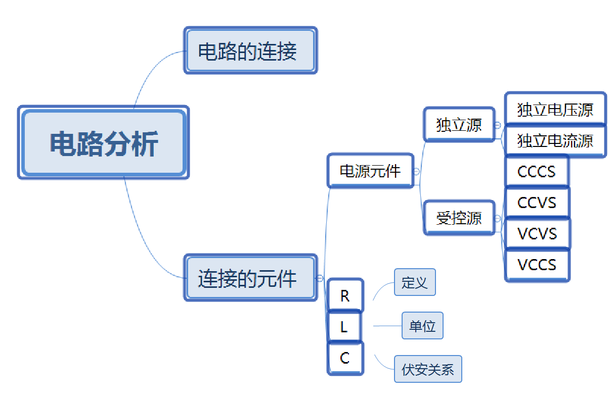

# 第2章 电路元件

这份思维导图展示得确实是很详细了，表现出了对于每一个电路元件我们需要知道的是什么。

## 本章目标

- 独立源、非独立源、电阻
- 陈述：欧姆定律、基尔霍夫定律
- 知道如何计算简单电路中每个元件的功率、并能够确定整个电路功率是否平衡

?>这一章学习之后学的是第六章。老师的思路是先把电路元件拉完，所以先把电容和电感讲了。

## 2.1 电压源和电流源

理想电压源不允许短路，理想电流源不允许开路。这与我们为它俩设定的特性有关。我们假定理想电压源的内阻为0,理想电流源的内阻为无穷大。

非独立源的大小依赖于控制它的电流或电压的大小。

此外还出现了几个参数，用于描述非独立源受控于电压或电流的关系，其实就是模电中接触到的放大电路中的那几个。比如电阻和电导需要格外注意吧(电导的单位西门子S)。

>到了这里，我已经感觉描述起来有一些力不从心，确实应该阅读老师的思维导图或者课件了。并且也不应该将课后再写笔记作为一种常态，我想这应该是更多用于预习并且在上课中提高效率的。

那么在上面的图中，表现出了受控源有四种形式CCCS、CCVS、VCVS、VCCS。

它们的命名规则是怎样的呢？

第二个字母C就是控制，第四个字母S就是源。所以这四个字母就可以表现出是谁控谁。

而关于谁控谁的大小的计算，则是通过在上面提到的参数来计算的。电压放大倍数、电流放大倍数、电阻、电导。

## 2.2 电阻(欧姆定律)

电阻的倒数称为电导，符号用字母G表示，单位是西门子(S)。

其余的部分，大多到也是些高中的知识。

## 2.3 电路模型结构

之所以对基本电路元件感兴趣，就是因为用基本电路元件可以构造实际系统的电路模型。尽管电路原理这本书主要强调的是求解电路所需的技巧，但是电气工程实际上还需要其他方面的技巧，其中最重要的技巧之一就是建模。

书上先使用了一个手电筒来耿建了一个电路模型。并指出，有时仅仅知道端子，那么就需要根据端子去构建出这个元件。

## 2.4 基尔霍夫定律

基尔霍夫定律可分为电流定律和电压定律。

- 基尔霍夫电流定律：在电路中，任何节点上的所有电流的代数和等于0
- 基尔霍夫电压定律：在电路中，任何闭合路径的所有电压的代数和等于0

十分直观，甚至不能再直观了。

>后面对含受控源电路进行了分析，我感到这部分内容比较陌生，虽然有我上课不认真听讲的原因在，但是更有可能的是，先讲了第六章的部分，讲电容和电感讲了，但是没有讲的深，只对元件进行了介绍，应该是这样的。
这样的话我写笔记就不好写了啊。。

## 含受控源电路的分析

（下节课教怎么列写方程）
