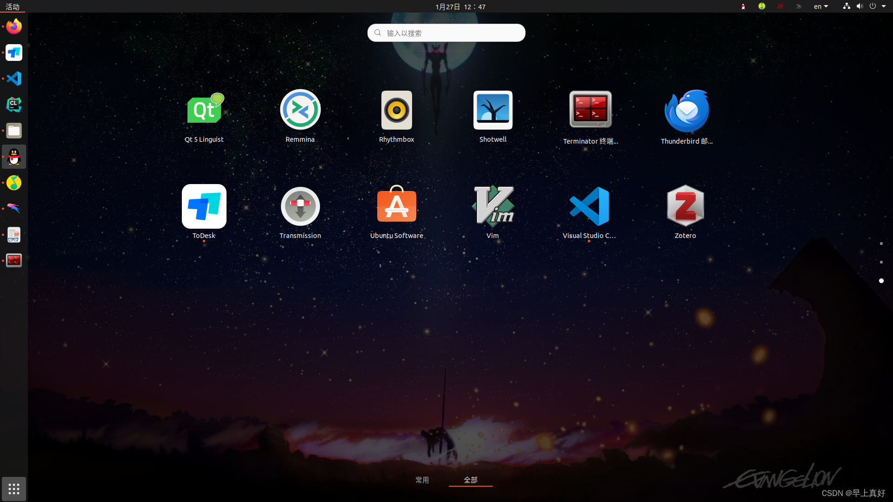
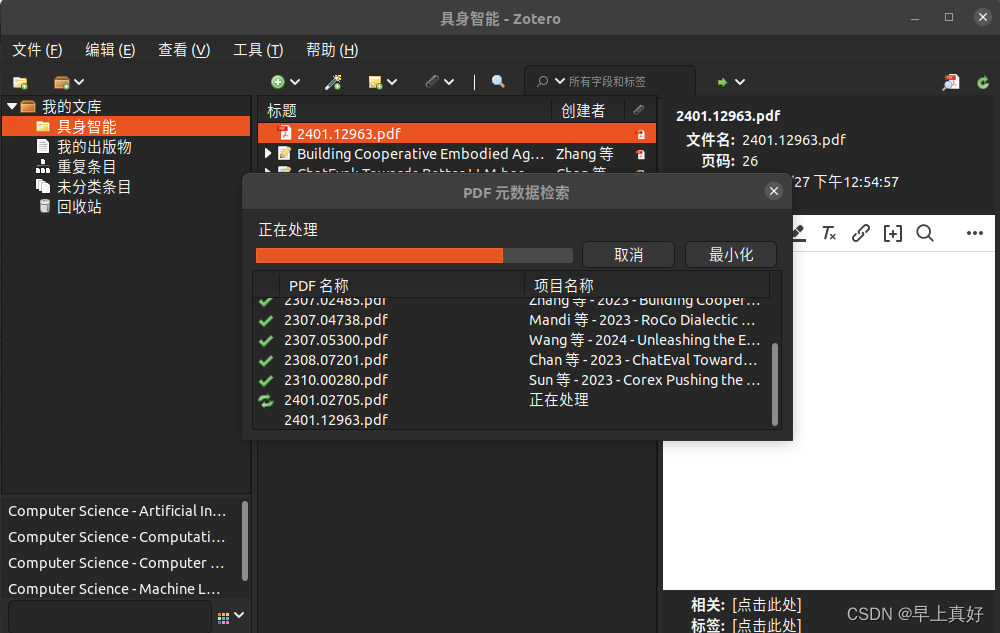
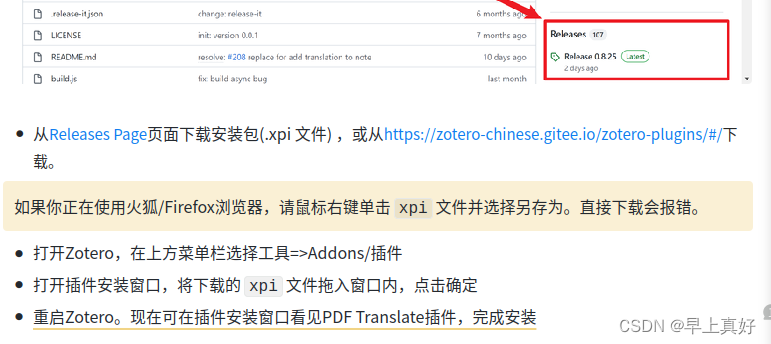
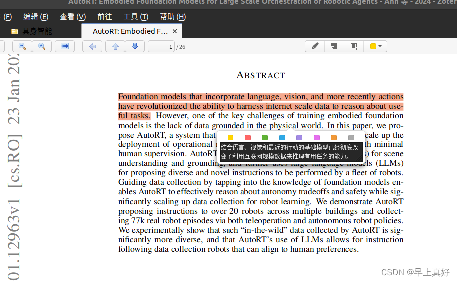

# 文献翻译 || Ubuntu安装zotero文献管理软件，提高文献阅读效率

## 前言

虽然在win下有很多文献管理软件和好用的文献翻译软件，但是如果平常有使用Ubuntu进行开发的需求，实际上很不愿意为了好好看文献专门切到Windows系统，所以在Ubuntu或者其他Linux发行版上安装文献管理软件还是很有必要的。

本文安装的文献管理软件是zotero，这是一款开源的文献管理软件，[deb系仓库链接](https://github.com/retorquere/zotero-deb)

<!-- more -->

## 安装方式选择

如果直接搜索安装方式，那么大部分安装方式都会是按照仓库里的要求添加软件源并安装。但是如果并不渴求最新版的话，没有必要一定从正在更新的仓库里去安装。从方便省事的角度考虑，先在现有软件源里搜索，没有再去添加源才是合适的做法。

### apt方式

尝试

```bash
sudo aptitude install zotero
```

出现以下返回

```bash
[sudo] zhaokace 的密码： 
Couldn't find any package whose name is "zotero", but there are 1 packages which contain "zotero" in their name:
  unity-scope-zotero 
无法应用某些操作，中止
```

可知实际上在Ubuntu现有源的apt包管理索引中是有这个软件的，可以安装`unity-scope-zotero`。

### snap方式

然后再试试snap软件包中有没有

```bash
snap search zotero
```

返回以下信息

```bash
名称           版本      发布者         注记   摘要
zotero-snap  6.0.27  extraymond  -    Zotero helps you collect, organize, cite, and share research.
qnotero      2.3.1   ealbiter    -    Standalone sidekick to Zotero reference manager.
zotviewer    2.2.1   fvalle      -    Zotero Visualizer
```

故知是存在的，并且是6.0.27版本，但是我们并不知道snap上的软件到底有没有按时更新，这个版本是否能够满足我们的需要。
使用命令

```bash
snap info zotero-snap
```

返回以下信息

```bash
name:      zotero-snap
summary:   Zotero helps you collect, organize, cite, and share research.
publisher: extraymond
store-url: https://snapcraft.io/zotero-snap
contact:   https://github.com/extraymond/zotero-snap
license:   AGPL-3.0
description: |
  Zotero is a free, easy-to-use tool to help you collect, organize, cite, and
  share research.
snap-id: atdqTPsFer1lIGP6OI4LXOzTLA0ZiOhK
channels:
  latest/stable:    6.0.27 2023-09-17 (65)  79MB -
  latest/candidate: 6.0.27 2023-09-17 (65)  79MB -
  latest/beta:      beta   2023-09-17 (67) 117MB -
  latest/edge:      6.0.27 2023-10-05 (69)  79MB -
```

故知更新情况还是比较新的，可以比较放心地使用。

最终选择snap方式安装，这种安装方式更加省心，安装和卸载都不容易伤到其他部分。

```bash
snap install zotero-snap
```

安装成功。

## zotero的简单使用

### 文献导入

除了左上角标准的文献导入方式，也可以直接拖拽pdf格式文件导入，软件会自动搜索项目名称等信息。


### 中文翻译插件

#### 下载并安装

这才是我要装文献管理软件的主要原因啊！浏览器翻译插件似乎只对Html页面有效，对于PDF格式文件则不起作用，英语及格的我只能装翻译插件了。

[插件开发者的文档](https://zotero.yuque.com/staff-gkhviy/pdf-trans/bwxwxh)


注意作者的提醒嗷。另外，我按照上面snap安装方式安装的是zotero6的版本，所以下载插件时应当下载稳定版本而不是预发布版本。故下载1.0.23版本哦。

#### 使用体验

我的评价是可以！
