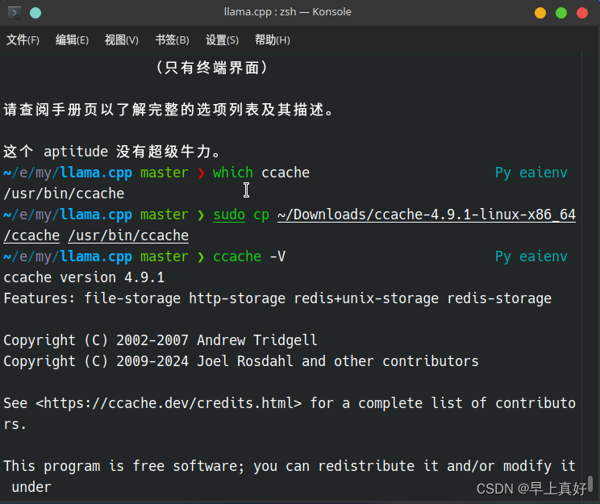

# 如何升级ccache的版本 || 安装ccache

由于一些原因之前用的是3.7的ccache，但是遇到了一个bug。

```bash
ccache: error: Recursive invocation (the name of the ccache binary must be "ccache")
```

经过查找，这个bug在4版本的时候被修复了，所以就要升级版本。

<!-- more -->

ccache的文件比较单一，环境变量、软链接啥的都是已经配置好的，所以这次一切从简，直接替换文件即可。

然后顺利开始编译。

> 在下载的文件中是可以找到manual的，它的ccache是放在local下的，和我不太一样。
> 但是话说回来，实际上手动安装的库文件、可执行文件一般都是在local下的，是我操作不规范了。

所以顺便贴一下这个manual的安装步骤

---
运行模式

使用ccache缓存编译有两种不同的方法：

在编译命令前面加上ccache。如果您只是想尝试ccache或希望将其用于某些特定项目，则此方法是最方便的。实例

```bash
ccache gcc -c example.c
```

让ccache伪装成编译器。当您希望对所有编译使用ccache时，此方法最有用。为此，创建一个指向ccache的符号链接，命名为编译器。例如，这里设置ccache以伪装成gcc和g++：

```bash
cp ccache/usr/local/bin/
ln-s ccache/usr/local/bin/gcc
ln-s ccache/usr/local/bin/g++
```

在不支持符号链接的平台上，您可以简单地将ccache复制到编译器名称，以获得类似的效果：

```bash
cp ccache/usr/local/bin/gcc
cp ccache/usr/local/bin/g++
```

等等只要带有符号链接或ccache副本的目录位于PATH中带有编译器（通常为/usr/bin）的目录之前，这将起作用。

---

我的环境变量设置命令如下

```bash
export USE_CCACHE=1
export CCACHE_DIR="/home/{your-username}/.ccache"
export CC="ccache gcc"
export CXX="ccache g++"
```
